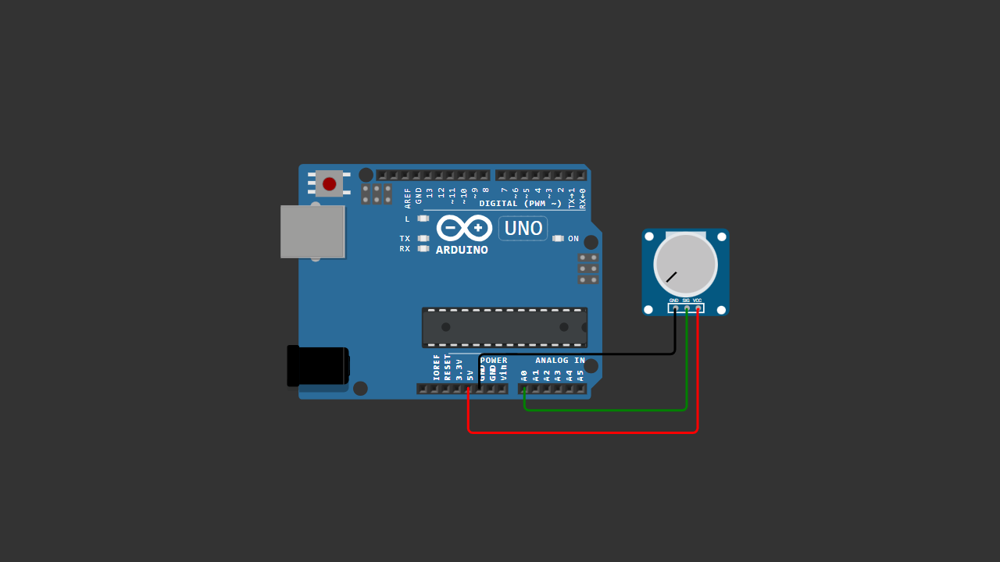

# Arduino Potentiometer Analog Reading

This project demonstrates how to read a rotary potentiometer using Arduino analog input.

The potentiometer outputs a variable voltage (0–5V), which is converted into digital values (0–1023) using the analogRead() function.

---

## 🧰 Components

- Arduino Uno / Nano
- 10K Rotary Potentiometer
- Jumper wires
- Breadboard (optional)

---

## 🔌 Wiring

Potentiometer → Arduino

- VCC pin    → 5V
- Signal pin → A0
- GND pin    → GND

If the value direction is reversed, swap VCC and GND.

---

## 📷 Wiring Diagram

> Make sure your wiring matches the diagram above before uploading the code.

---

## 💻 How It Works

- The potentiometer acts as a voltage divider.
- Arduino reads the analog voltage using `analogRead(A0)`.
- Output range: 0 – 1023.
- Values are displayed in the Serial Monitor.

---

## 💻 Arduino Code

You can download the Arduino sketch here:

[Download Arduino Code](Arduino_Potentiometer_Analog_Reading.ino)

Or open the `.ino` file directly inside this repository.

---

## ▶️ Video Tutorial

Watch the full tutorial here:
https://youtu.be/zorD1mKqGYY

---

## 📜 License

This project is open-source for educational purposes.
